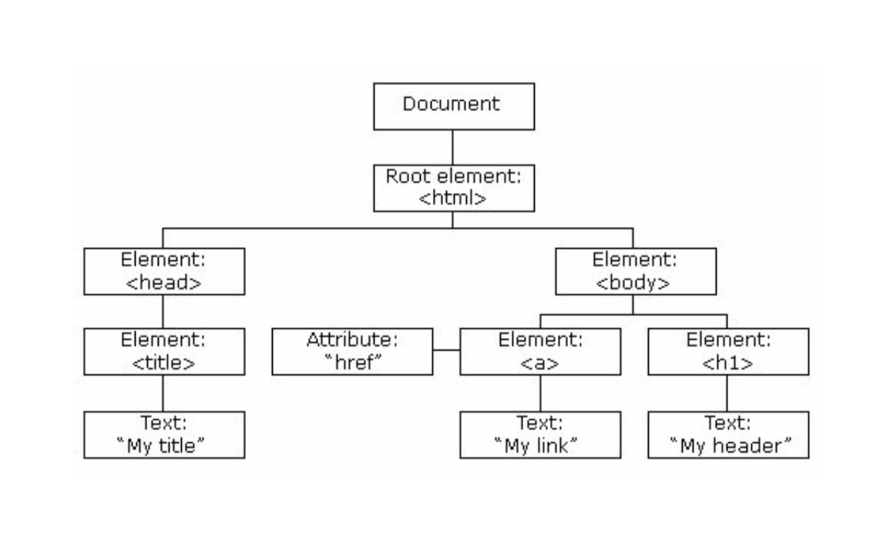

## JavaScript

### De DOM
<<<<<<< HEAD
Het Document Object Model is een manier om de structuur en stijl van een HTML-pagina te manipuleren. Het vertegenwoordigt de binnenkant van de pagina zoals de browser die ziet. 
Met behulp van Javascript is het mogelijk om de DOM aan te passen. Zo kan je DOM elementen aanpassen, maar ook verwijderen of toevoegen.

#### Trees and branches
HTML heeft een hiërarchische structuur. 
De elementen die deze structuur vormen hebben stamboom structuur met ouders, kinderen en broers/zussen. 

Zo heeft het `<html>` root element twee takken:
`head` en `body`. Elke tak kan op zijn beurt verschillende vertakkingen hebben. Om deze reden wordt de DOM ook wel de DOM-boom genoemd.



Wijzigingen aan de DOM kunnen gemaakt worden door een element aan te passen, toe te voegen of te verwijderen. Al deze handelingen worden met behulp van Javascript gedaan. Om toegang te krijgen tot de DOM vanuit JavaScript, wordt het `document` object gebruikt. 
Het wordt geleverd door de browser en laat interactie toe tussen Javascript en HTML code.

#### Een element selecteren
Om een bepaald element aan te passen 
=======
Het Document Object Model geeft de structuur van een HTML-pagina weer. De platte tekst wordt omgezet naar een verzameling afzonderlijke objecten. Je kan deze manipuleren om de structuur en stijl van je webpagina aan te passen.
Het is ook de manier waarop de browser een webpagina ziet. Met behulp van Javascript kan je de DOM manipuleren.
Als je de DOM van een pagina wilt bekijken, open dan de ontwikkeltools in je browser en zoek naar de "element inspector". In de meeste browsers kunt u DOM-elementen direct verwijderen en wijzigen.

#### Trees and branches
HTML is opgebouwd uit een XML-structuur. 
De elementen die deze XML-structuur vormen hebben een knooppuntstructuur met ouders en kinderen. Zoals de stam en takken van een boom. Er is een root element (html) met takken zoals `head` en `body`. Elke tak kan zich op zijn beurt opnieuw vertakken.
Om deze reden wordt de DOM ook wel de DOM-tree genoemd.
Door een HTML element te selecteren en de eigenschappen aan te passen kan je de DOM aanpassen.
Om toegang te krijgen tot de DOM vanuit Javascript, wordt het `document` object gebruikt. 
Het wordt geleverd door de browser en stelt je in staat om HTML en Javascript samen te gebruiken.

#### Een element verkrijgen
Allereerst moeten we weten hoe we een element of een verzameling van elementen te selecteren. 
>>>>>>> 5b02312eb1e115ca6cd0df628ecdfa5cacebc24c
Er zijn een aantal manieren om dit te doen.

- via id
- via tag
- via class
- via css selectors
- via name attribuut

#### via id
[`document.getElementById(id)`](https://developer.mozilla.org/en-US/docs/Web/API/Document/getElementById) is een methode om een element aan de hand van zijn id te verkrijgen.

```
<p id="fancyText"> Dit is de intro tekst</p>

const fancyText = document.getElementById('fancyText'); 
```
Merk op dat `getElementById` een methode van het documentobject is. De meeste methoden die gebruikt worden om toegang te krijgen tot de pagina staan op het documentobject.

<<<<<<< HEAD
#### via tag

[`document.getElementByTagName(name)`](https://developer.mozilla.org/en-US/docs/Web/API/Document/getElementsByTagName) werkt op dezelfde manier als `getElementById`, behalve dat het een tagnaam (div, ul, li, etc.) neemt in plaats van een ID. Het geeft een `NodeList` terug, wat in wezen een array is van de gevonden DOM-elementen.

#### via class
`document.getElementsByClassName` geeft dezelfde soort `NodeList` terug als `getElementsByTagName`, behalve dat je een klassennaam passeert en niet een tagnaam.
=======
`const pageHeader = document.getElementById('pageHeader');`

Het `pageHeader` element kan vervolgens gemanipuleerd worden. 
De grootte en kleur kunnen bijvoorbeeld worden gewijzigd. 
Of een andere code kan worden gedeclareerd om het element te beheren wanneer u erop klikt of wanneer het wordt overgeschoven.
Merk op dat `getElementById` een methode van het documentobject is. 
De meeste methoden die gebruikt worden om toegang te krijgen tot de pagina staan op het documentobject.
Door de tag (tagnaam)
`document.getElementsByTagName` werkt op dezelfde manier als `getElementById`, behalve dat het een tagnaam (div, ul, li, etc.) neemt in plaats van een ID. Het geeft een `NodeList` terug, wat in wezen een array is van de gevonden DOM-elementen.

#### Op class naam
`document.getElementsByClassName` geeft dezelfde soort `NodeList` terug als `getElementsByTagName`, behalve dat je selecteert zoekt naar een bepaalde klasse in plaats van een tag.
>>>>>>> 5b02312eb1e115ca6cd0df628ecdfa5cacebc24c

#### via CSS-selector
Nieuwe methoden zijn beschikbaar in moderne browsers. 
Ze maken elementenselecties gemakkelijker door het gebruik van CSS-selectoren toe te staan. 
Deze zijn dat wel: `document.querySelector` en `document.querySelectorAll`.
```
var Header = document.querySelector ('#header');
var button = document.querySelectorAll('.btn');
```
querySelector, zoals `getElementById`, geeft een enkel element terug, terwijl `querySelectorAll` een `NodeList` geeft. 
Als meerdere elementen overeenkomen met dezelfde selector en je gebruikt `querySelector`, zal alleen het eerste element worden geretourneerd.


**Oefening**: [DOM](./exercise.md)
