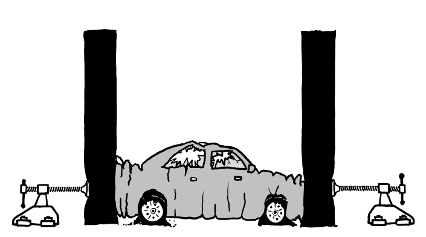

# First serie of JavaScript for the Web Exercises

## 1.1 - Color selector

Display three buttons named "Blue", "Red" and "Green" as well as a `
` shaped like a square which should be black by default.

When you click on any of these buttons it should change the color of the `
` to the corresponding color.

## 1.2 - Calculator

Display two text boxes and four buttons named "+", "-", "x" and "/". Make the calculator work correctly by displaying the result of the operation when the user clicks one of the buttons.

## 1.3 - Super Vilain application form

Display a form asking for the user's super vilain name, super power, motivation and plan to conquer the world.

The form should have two buttons, "Reset" and "Display". When clicking "Reset" it should erase the value of all the form elements to allow re-entering everything. When clicking "Display" it should erase the whole form and the buttons from the screen and display a text with headers showing the result collected in the previous form.

When it's done, fill the form, display the result, print it and give it to your coach. He received special instructions and knows what to do with it.

## 1.4 - Age calculator

Display three select boxes allowing to enter a birthdate. When the user selects a value for each of the select boxes, display its age.

Bonus: Make your components smart by making it impossible to enter a date that doesn't exist. (Like 1990-04-31 or 1991-02-29.)

## 1.5 - Cat cycler

Use your Google Images skills to collect a dozen of cat images.

Display these cat images in your app one by one by cycling automatically every second. These images must be displayed in a 500x500 pixel square and should be resized and cropped automatically to fit in this space regardless of their original resolution or aspect-ratio. (Purposedly choosing images that all have the same resolution or aspect-ratio is considered cheating.)

If you ever alter the aspect-ratio of an image to make it deformed we swear we will do this your car. (Or your bike if you don't have a car.)

Bonus: Choose cats that are really really cute.

## 1.6 - Cat randomizer

Re-use the collection of cat images you made for the last exercise but this time display all of them at the same time in 100x100 pixel squares. When you click on a button randomize the order of the cats.

This screen should be fully [responsive](https://en.wikipedia.org/wiki/Responsive_web_design) and display nicely even on phones. (Use your browser's device emulation mode to test.)

## 1.7 - Troll button

Display a button saying "Click me". When the user moves the mouse on top of the button to click on it the button should jump to a completely different place on the page which is not under the mouse cursor anymore. It should continue to do so regardless the number of times the user tries to relocate the mouse cursor to try to click on it and always jump at a random place.

Bonus: after a few misclicks, display insulting messages to let the user know he can't even click on a button.