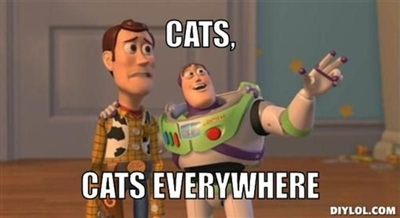

# JavaScript for the Web

This course necessitate to have followed the HTML, CSS and Algorithmics with JavaScript courses.

That's it ! You are now a complete programmer that knows all the bases. You can now begin the real stuff about frontend development by making crazy applications with animations, dynamism and cats. A lot of cats !

:smiley_cat: :smile_cat: :heart_eyes_cat: :kissing_cat: :smirk_cat: :scream_cat: :crying_cat_face:	:joy_cat: :pouting_cat:

## A Brief Look into the Theory

[A Brief Look into the Theory](./theory.md)

## Exercises

### The becode JavaScript exercise template

[The template folder](./template) contains a full template to use for this serie of exercises. Just copy-paste the complete folder for each exercise and modify its content. Also read carefully the readme as this template use some advanced features to get you started with modern JavaScript development environment.

### Exercises

* [First serie](./ex-01.md)
* [Second serie](./ex-02.md)
