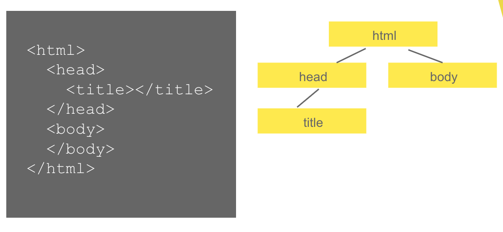

# A Brief Look into the Theory

## Adding JavaScript to an HTML document

```html
<script src="./script.js"></script>
```

It's not much more complicated than that. The browser will load the file and execute its content.

## Activating the strict mode

Contrary to a JavaScript file loaded by Node.js, browsers use by default an older version of the JavaScript syntax *which is much more error-prone*. Serious guys and gals, you can do so much stupid things it's crazy.

To avoid this you can add this line at the top of your file:

```javascript
"use strict";
```

It may seem this instruction does nothing but it's a special one that is used by the Web browser to detect files written in recent JavaScript.

Remember, be safe, activate strict mode !


**Exception**: In the JavaScript template recommended for the exercises we use a JavaScript bundler that automatically activates the strict mode. So you don't really have to add this line in this case.

## The DOM

Remember your HTML course ? What it may not tell you is that when the browser loads a HTML file containing a bunch of tags it creates an object for each of these tags.

These objects are then linked between them to create what we call a **tree**.



This big tree containing objects is what we call the **Document Object Model** (DOM for short).

The game when trying to animate stuff in a web page with JavaScript is to find the correct elements and alter them dynamically.

## Testing and debugging

[JSFiddle](https://jsfiddle.net/) is an excellent website to quickly test a few pieces of code with HTML + CSS + JavaScript. All the examples below can be tested and modified with it.

Also think about displaying the [Dev Tools](https://developers.google.com/web/tools/chrome-devtools/) of your browser. At the very least it allows you to see the result of `console.log()` but it also contains a lot of useful tools.

## Select elements in the DOM

```html
<div id="mydiv">
  <span>Hello</span>
  <span>World</span>
</div>
```
```javascript
console.log(document.querySelector("#mydiv")); // The div with "mydiv" id
console.log(document.querySelectorAll("#mydiv span")); // an array of two spans
```

[`document.querySelector()`](https://developer.mozilla.org/en-US/docs/Web/API/Document/querySelector) selects one element and [`document.querySelectorAll()`](https://developer.mozilla.org/en-US/docs/Web/API/Document/querySelectorAll) selects multiple elements to return an array. They both take a CSS selector as argument.

## Modify HTML inside an element

```html
<div id="mydiv">
</div>
```
```javascript
document.querySelector("#mydiv").innerHTML = '<div style="display: inline-block; width: 100px; height: 100px; background-color: red;"></div>';
```

[`element.innerHTML`](https://developer.mozilla.org/en-US/docs/Web/API/Element/innerHTML) gives direct access to the HTML code inside an element.

There's also [`element.innerText`](https://developer.mozilla.org/en-US/docs/Web/API/HTMLElement/innerText) that does the same thing for text.

```html
<p id="myparagraph">
</p>
```
```javascript
document.querySelector("#myparagraph").innerText = 'I am the king of the world!';
```

## Modify CSS of an element
```html
<div id="mydiv" style="display: inline-block; width: 100px; height: 100px;">
</div>
```
```javascript
document.querySelector("#mydiv").style.backgroundColor = "blue";
```

[`element.style`](https://developer.mozilla.org/en-US/docs/Web/API/HTMLElement/style) contains all the CSS attributes of an element.

## Bind events

```html
<p>
  <button id="mybutton">Click Me</button>
</p>
<p id="myparagraph">
</p>
```
```javascript
document.querySelector("#mybutton").addEventListener("click", () => {
  document.querySelector("#myparagraph").innerText = "You clicked it!";
});
```

[`element.addEventListener`](https://developer.mozilla.org/en-US/docs/Web/API/EventTarget/addEventListener) allows to bind an event. It takes as argument the name of the event and a function that will be called when the event is triggered.

[There is a huge amount of events you can bind on DOM elements.](https://developer.mozilla.org/en-US/docs/Web/Events)

## Form elements values

```html
<p>
  <input id="myinput" type="text" placeholder="Type something">
  <button id="mybutton">Send</button>
</p>
<p id="myparagraph">
</p>
```
```javascript
document.querySelector("#mybutton").addEventListener("click", () => {
  let value = document.querySelector("#myinput").value;
  document.querySelector("#myparagraph").innerText = "You typed " + value;
});
```

[`element.value`](https://developer.mozilla.org/en-US/docs/Web/API/HTMLInputElement) allows to access the value of an input.

## And that's it

Yep, that's it. Now go for the exercises.

*What ?? Won't you teach me more ? I can't make everything I need in web development with so few theory.*

Yes you can. Of course you'll need a lot more to do everything you want but you can find all the info you need by googling a little.

The features integrated in web browsers are so vast that not a single person can pretend knowing everything anyway. Searching for features to know how to do stuff is a completely normal part of everyday programming. If you want a good reference the [MDN Web Docs](https://developer.mozilla.org/en-US/) is the best one you can find.

Also, you are a programmer now. You don't need huge pieces of theory and can learn everything you need by yourself. So go for the exercises now !